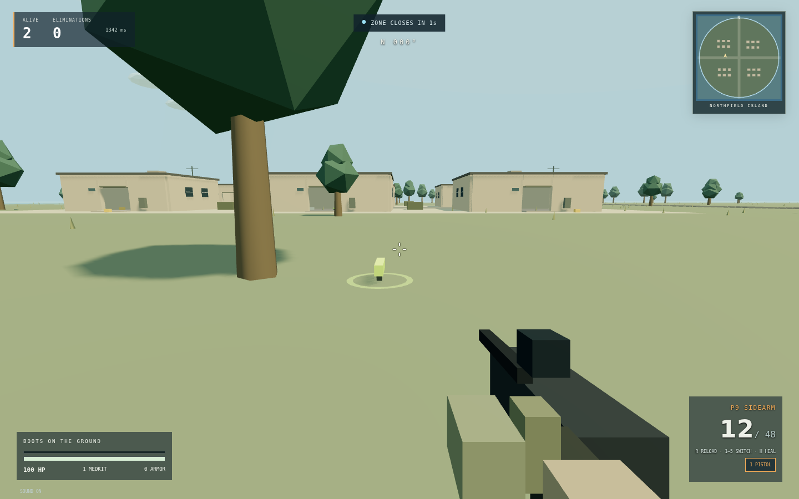

# LAST DROP · Island Royale

An original, playable browser battle royale prototype. The client is HTML, CSS, JavaScript and Three.js; a Node.js WebSocket server owns the match simulation. All interface text is English. No Unity editor, paid assets, external CDN or account is needed.



**Status:** early multiplayer prototype, not a finished PUBG/Free Fire equivalent. Supports a room capacity of 50, private lobby passwords, optional training bots and complete match progression. Production internet hosting and 50-device gameplay have not been validated.

**[Инструкция на русском → README.ru.md](README.ru.md)**

## Run after downloading

1. Download the repository with **Code → Download ZIP** and extract it.
2. Install **Node.js 22 or newer** from [nodejs.org](https://nodejs.org/).
3. In the extracted project directory:

```sh
npm ci
npm start
```

4. Open **http://localhost:3000**. Keep the terminal running.

Windows: double-click `start-windows.bat`. macOS/Linux: run `sh start-macos-linux.sh`. The helpers install dependencies on first use. Installation needs internet; gameplay then uses local assets.

**Opening `index.html` directly will not work.** Real multiplayer requires the included server. GitHub hosts the source; GitHub Pages alone cannot run this backend.

## Play with friends

- Enter a callsign and create a lobby. Set an optional password and choose 0, 9, 19, or up to 49 bots.
- Send friends the **same server address**, the six-character lobby code, and the password if set. A lobby code alone does not discover a server.
- On the same Wi-Fi, friends can use `http://YOUR-COMPUTER-LAN-IP:3000` if the firewall allows it. `localhost` on another device points to that device, not the host.
- For internet play, deploy this project to a persistent Node.js/container host that supports WebSockets. Use HTTPS/WSS through the host's TLS proxy. Configure its health check to `/health`; startup is `npm ci` then `npm start`; `PORT` is read from the environment.
- Only the host can start. At least two combatants (humans + bots) are required. Bots fill available slots without displacing humans.
- Joining after a match starts is disabled. A disconnected player is eliminated; if the host leaves, hosting passes to a remaining player. There is no reconnection resume yet.
- After a winner is decided, the host can return everyone to the lobby.

## Controls

| Action                      | Desktop          | Touch            |
| --------------------------- | ---------------- | ---------------- |
| Move                        | WASD / arrows    | Left stick       |
| Sprint                      | Shift            | Push stick fully |
| Aim                         | Mouse            | Drag right area  |
| Fire                        | Left mouse       | FIRE             |
| Aim down sights             | Hold right mouse | Toggle ADS       |
| Exit plane / deploy chute   | Space            | JUMP / CHUTE     |
| Pick up nearby loot         | E                | USE              |
| Reload                      | R                | R                |
| Heal                        | H                | +                |
| Select owned weapon         | 1–5              | GUN              |
| Release mouse / pause input | Escape           | —                |

Touch layouts are included. Landscape orientation is recommended. Performance on physical phones has not been measured.

## Included

- Lobby creation/joining by code, optional hashed password, roster, host migration, bot settings, rematch.
- Five-second deployment screen, moving transport aircraft, manual exit, freefall, steerable automatic/manual parachute and landing.
- A 480 × 480 m low-poly island, four settlements, 24 enterable single-floor houses, roads, trees, rocks, cover, rooftop props and a radio mast.
- Pistol, assault rifle, SMG, DMR and shotgun with distinct damage, cadence, range, spread, magazine and reload time.
- Server-side ray hits, cover obstruction, head multipliers, ammo, armour, medkits, loot and dropped weapons.
- A contracting circular zone, escalating outside-zone damage, eliminations, spectator view and last survivor result.
- Bots with basic steering, line-of-sight targeting, shooting, reloading, healing, pickups and zone movement.
- Mini-map, compass, health/armour/ammo HUD, inventory, hit feedback, kill feed and synthesized gun sounds.
- Desktop mouse capture, touch controls, connection failure handling and same-origin local assets.

## Backend

`server/index.js` serves client/assets and `/ws`. Rooms live in memory on one process. `server/match.js` runs a fixed **20 Hz authoritative simulation**, with **10 Hz snapshots** and client interpolation. Clients submit movement/look/button intent; they cannot directly set positions, damage, health, loot ownership or the winner.

`shared/world.js` defines map geometry and weapon rules shared by rendering and simulation. No database is required for this ephemeral, anonymous prototype.

Protections include 4 KiB message limits, per-socket token buckets, lobby-request throttling, bounded connections/rooms, slow-client disconnects, heartbeats, origin validation, password hashing with per-room salts, strict equip/input validation, safe text rendering and an HTTP content allowlist. These are baseline safeguards, not a complete competitive anti-cheat system.

Environment variables:

| Variable          | Default   | Purpose                                                                       |
| ----------------- | --------- | ----------------------------------------------------------------------------- |
| `PORT`            | `3000`    | HTTP and WebSocket port                                                       |
| `HOST`            | `0.0.0.0` | Listen address; use `127.0.0.1` for local-only                                |
| `ALLOWED_ORIGINS` | empty     | Optional comma-separated extra WebSocket origins; same-origin already allowed |

Passwords are never included in lobby snapshots. Use TLS for remote play. Forward WebSocket upgrades through the reverse proxy. Rooms and progress disappear when the server restarts. Multiple replicas need room routing/ownership; a round-robin load balancer is insufficient.

## Checks

```sh
npm test       # game rules, malformed inputs, lobby lifecycle, 50 sockets, HTTP boundaries
npm run loadtest  # 50 synthetic local clients, 30 seconds; prints timing and traffic
```

Set `LOAD_SECONDS=60` for a longer run on Unix-like systems. The load check includes clients and server in the same process: it is not a WAN latency test, hardware sizing guarantee or 50-renderer benchmark. No extra testing dependencies are needed for these checks.

## Docker

```sh
docker compose up --build
```

Open port 3000 locally. Put an HTTPS reverse proxy in front for internet deployment. The container runs as a non-root user. The Docker recipe is provided; validate it on the deployment machine.

## Scope and next work

Art is procedural low-poly, not photorealistic. Windows are decorative; buildings have open doors. There are no vehicles to drive, destructible buildings, prone/crouch/jump mechanics on land, grenades, teams, voice chat, persistent accounts, matchmaking, commerce, saved progression or production moderation.

Networking uses WebSockets, basic interpolation and server hit checks without prediction/rewind lag compensation. Snapshots expose match positions to connected clients; visibility filtering is needed before competitive public release. There is no bullet travel/drop simulation. Bots use lightweight steering rather than a navigation mesh and can struggle near obstacles. Improve those systems, introduce visibility-based replication and measure real-device/WAN load before treating 50-player matches as production-ready.

## Structure

```text
client/       HTML, CSS, controls, Three.js island renderer, HUD, audio
shared/       Map, collision helpers and weapon configuration
server/       HTTP/WebSocket lifecycle and authoritative match logic
test/         Automated rule and network tests
scripts/      Local 50-client load check
```

All game code and procedural visuals in this repository are original to this project. Three.js and ws remain under their respective dependency licenses. No PUBG or Free Fire assets are included.
